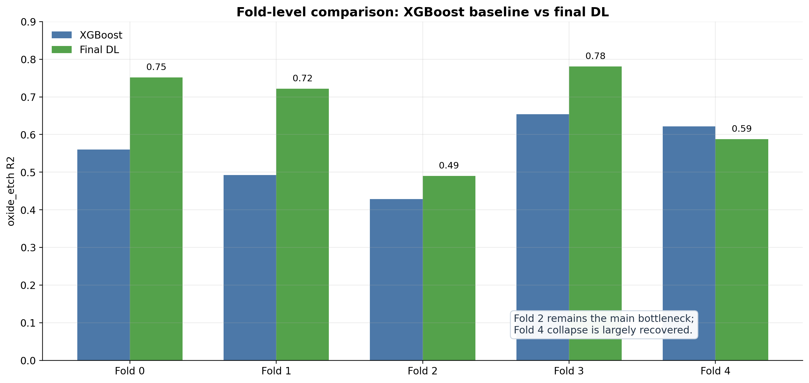
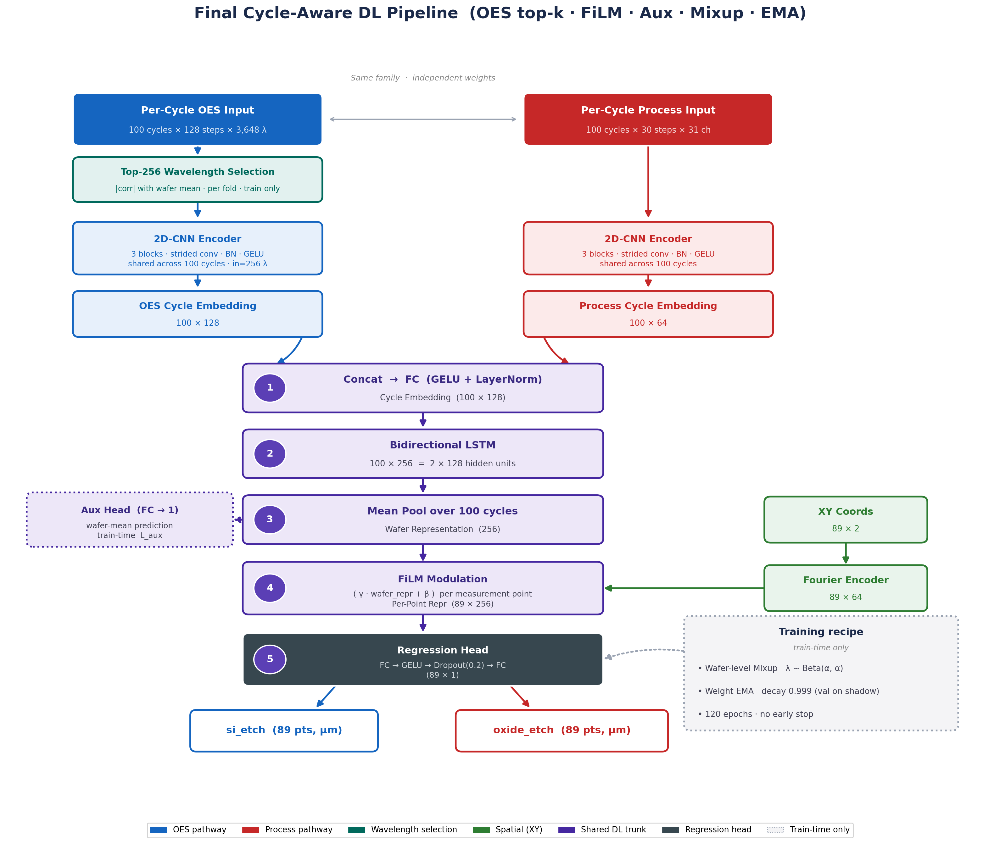
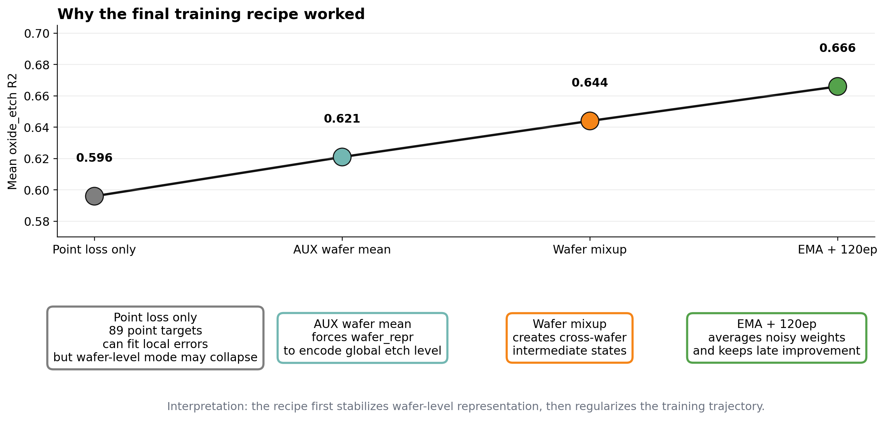
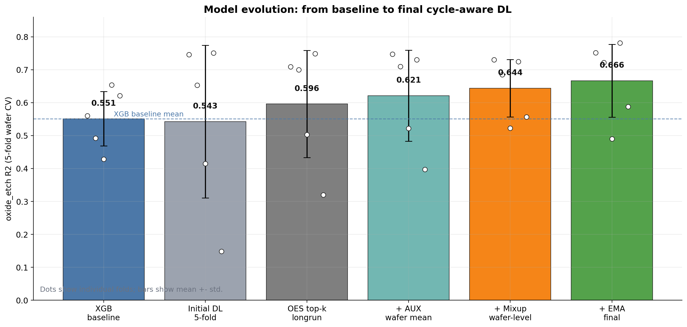

# BOSCH Plasma Etching — Cycle-Aware Deep Learning 기반 가상 계측 (Virtual Metrology)

> BOSCH DRIE(Deep Reactive Ion Etching) 플라즈마 식각 공정에서 수집된 **OES 스펙트럼 + Process 센서 시계열**로부터
> 웨이퍼 89개 지점의 **식각량(`si_etch`, `oxide_etch`)** 을 예측하는 딥러닝 가상 계측 모델.
> 학부 졸업논문(종합설계) 프로젝트.

**핵심 아이디어** — BOSCH 공정은 SF₆(식각) / C₄F₈(패시베이션)가 100회 교대하는 *사이클릭* 공정이다.
기존 VM 연구는 OES를 평균·분산 같은 통계로 뭉개서 **사이클 간 시간 변화**를 버린다.
본 프로젝트는 100개 사이클 구조를 그대로 텐서로 만들어 **cycle-aware 딥러닝 인코더**에 넣고,
XGBoost 수공학 피처 baseline과 정면 비교한다.

---

## 1. 한눈에 보는 결과

`oxide_etch`, **5-fold wafer-level GroupKFold** (같은 웨이퍼의 89 포인트는 절대 train/val에 분산되지 않음)

| 모델 | R² (mean±std) | RMSE (mean±std) |
|---|---|---|
| XGBoost baseline (cycle 통계 피처) | 0.551 ± 0.082 | 0.0514 ± 0.004 |
| **제안 모델 (Cycle-Aware DL, 최종)** | **0.666 ± 0.110** | **0.0440 ± 0.007** |

→ **R² +0.115 / RMSE −14.4%**. 최종 실험 폴더:
[`outputs/experiments/2026-05-28_04-19_dl-multimodal-oes-aux-mixup-ema-longrun-5fold/`](outputs/experiments/2026-05-28_04-19_dl-multimodal-oes-aux-mixup-ema-longrun-5fold/)



`si_etch`는 모든 모델이 R² ≈ 0.99로 포화되어 변별력이 없다 — 이유는 §2 참고.

---

## 2. 왜 `oxide_etch`가 진짜 문제인가 (이 프로젝트를 읽는 열쇠)

타겟 분산을 **웨이퍼 내부(공간 위치)** vs **웨이퍼 간(공정 변동)** 으로 분해하면 두 타겟의 성격이 완전히 갈린다.

| 타겟 | within-wafer std | between-wafer std | 분산 비율 | Spatial-mean baseline R² |
|---|---|---|---|---|
| `si_etch` | 3.61 μm | 0.40 μm | **99% / 1%** | **0.985** |
| `oxide_etch` | 0.064 μm | 0.044 μm | 68% / 32% | **0.156** |

- **`si_etch`** — 분산의 99%가 챔버의 고정된 공간 비균일성에서 온다. 학습 없이 (X, Y) 위치별 평균만 찍어도 R²=0.985.
  즉 **sanity target**이지, 모델 우열을 가리는 지표가 아니다. (VM 논문들이 흔히 빠지는 "R²=0.99 함정")
- **`oxide_etch`** — 위치만으로는 R²=0.156. *그 웨이퍼가 어떤 플라즈마 상태로 처리됐는지*를 사이클 신호에서 읽어야만 풀린다.
  → **본 연구의 contribution 검증 타겟**이며, 아래 모든 실험은 oxide 중심이다.

---

## 3. 데이터셋

Chemnitz University of Technology / Fraunhofer ENAS의 2024년 BOSCH 식각 공개 실험 데이터셋.

| 데이터 | 형태 | 규모 |
|---|---|---|
| OES | NetCDF 시계열 스펙트럼 | ~14,744 timestep × **3,648 wavelength** |
| Process | NetCDF 센서 시계열 | ~3,245 timestep × 44 channel |
| 측정값 | CSV | **88 wafer × 89 point = 7,832 sample** |

- 장비: SPTS Omega i2L DSi Rapier / 200 mm Si(100) 웨이퍼 / 1 μm SiO₂ 마스크
- **10 Lot**, 각 Lot 10매 순차 처리(중간 세정 없음 → 의도적 공정 drift), 컨디셔닝 조건 변화
- 공정 구조: 1초 점화 후 **100 cycle** (SF₆ 4.5 s + C₄F₈ 1.5 s)

> `Dataset/` 는 용량 문제로 **git에 포함되지 않는다**(`.gitignore`). 원본을 받아 `Dataset/` 에 놓아야 재현 가능.
> 원본은 read-only — 어떤 파생 파일도 여기에 쓰지 않는다.

---

## 4. 방법

### 4.1 아키텍처



```
OES cycle tensor        Process cycle tensor       (X, Y) 측정 좌표
(B, 100, 128, 256)      (B, 100, 30, 31)           (B, 89, 2)
       │                        │                        │
   2D-CNN (사이클 공유)      2D-CNN (사이클 공유)      Fourier feature 인코더
       └──────── concat ────────┘                        │
                  │                                      │
        cycle fusion FC → Bi-LSTM(100 step) → wafer_repr │
                  │                                      │
                  └────────── FiLM 변조 ─────────────────┘
                                 │
                       per-point regression head → 89개 예측
```

**설계 포인트**

- **Cycle-aware 텐서화** — 원시 (14,744 × 3,648) 을 그대로 넣는 대신, 사이클 경계로 잘라
  `(100 cycle, t, channel)` 텐서를 만들고 2D-CNN을 사이클 간 공유해 통과시킨다. 시간 구조를 버리지 않으면서 차원을 통제.
- **Multimodal early fusion** — OES / Process 사이클 임베딩을 결합 후 Bi-LSTM.
  단일 모달 대비 명확한 이득 (fold 0: OES-only 0.346, Proc-only 0.640, **Multimodal 0.734**).
- **FiLM + Fourier(X, Y)** — 89개 포인트가 같은 `wafer_repr` 을 공유하므로, 좌표 2개 스칼라만으로는 포인트를 구별할 수 없다.
  (X, Y)를 Fourier 인코딩해 wafer 표현을 **포인트별로 affine 변조**한다. (없으면 성능 붕괴 — 필수 구성)
- **OES wavelength selection** — fold의 **train split만** 사용한 상관 기반 top-k=256 밴드 선택 (누수 차단).

### 4.2 학습 안정화 3종 (최종 성능의 대부분)

oxide 타겟은 분포가 bimodal이라, 특정 fold에서 인코더가 high-mode 웨이퍼들을 **동일한 표현으로 붕괴(collapse)** 시키는 문제가 있었다.

| 기법 | 무엇 | 효과 |
|---|---|---|
| **Wafer-mean auxiliary loss** (λ=0.3) | `wafer_repr → Linear(d,1)` 로 웨이퍼 평균을 직접 예측 | collapse 압력 차단. fold 4 R² 0.32 → 0.40 |
| **Wafer-level mixup** (Beta(0.2,0.2)) | 웨이퍼 단위로 입력·타겟 선형 보간 | collapse attractor 파괴. fold 4 0.40 → 0.56, fold 간 std −37% |
| **EMA + 120ep no-early-stop** (decay 0.999) | shadow weight로 검증·추론 | mixup 노이즈 흡수. aggregate 0.644 → **0.666** |



---

## 5. 결과

### 5.1 개선 누적 (oxide, 5-fold)

| 실험 | f0 | f1 | f2 | f3 | f4 | agg R² | RMSE |
|---|---|---|---|---|---|---|---|
| XGB baseline | 0.56 | 0.49 | 0.43 | 0.65 | 0.62 | 0.551±0.082 | 0.0514 |
| DL longrun | 0.71 | 0.70 | 0.50 | 0.75 | 0.32 | 0.596±0.163 | 0.0482 |
| + aux loss | 0.75 | 0.71 | 0.52 | 0.73 | 0.40 | 0.621±0.138 | 0.0468 |
| + mixup | 0.73 | 0.69 | 0.52 | 0.73 | 0.56 | 0.644±0.087 | 0.0458 |
| **+ EMA / 120ep ★** | **0.75** | **0.72** | **0.49** | **0.78** | **0.59** | **0.666±0.110** | **0.0440** |



### 5.2 정직한 한계 — LOO-Lot 일반화

새로운 **Lot 전체를 held-out** 으로 두는 Leave-One-Lot-Out 평가에서는 성능이 크게 떨어진다 (aux-loss 모델 기준):

- **aggregate R² = 0.323 ± 0.294** (5-fold의 0.621 대비 절반)
- 잘 되는 Lot: Lot 1 (0.81), Lot 2 (0.68) / 학습 자체가 실패: Lot 4 (−0.19), Lot 6 (−0.01)
- **해석: 모델이 lot-specific 패턴에 의존한다.** 웨이퍼 단위 CV의 성능이 곧 새 lot 대응력은 아니다.

이는 실제 fab 배포 관점에서 가장 중요한 미해결 과제이며, 숨기지 않고 논문의 한계로 명시한다.
(현 best 모델 mixup+EMA 조합의 LOO-Lot 재평가는 아직 미수행 — §8 참고)

---

## 6. 리포지토리 구조

```
BOSCH-Plasma-Etching/
├── CLAUDE.md / AGENTS.md      # 프로젝트 규칙 (AI 에이전트 협업 규약 포함)
├── Dataset/                   # 원본 데이터. read-only, gitignored
├── src/                       # 라이브러리 코드 (import 전용, 부작용 없음)
│   ├── data/                  #   NetCDF 로더, cycle 세그멘테이션, 캐시 I/O, Dataset
│   ├── features/              #   cycle 통계(XGB용), OES 밴드 선택
│   ├── models/                #   cycle_encoder.py, bilstm_vm.py (제안 모델)
│   ├── evaluation/            #   metrics, wafer-level GroupKFold / LOO-Lot split
│   ├── demo/                  #   시연용 추론 래퍼
│   └── utils/                 #   make_experiment_dir, set_seed
├── scripts/                   # 실행 엔트리 (`python -m scripts.NN_name`)
├── configs/                   # 실험 config YAML — 1 실험 = 1 파일
├── cache/vN/                  # 전처리 산출물. gitignored, 재생성 가능
├── outputs/
│   ├── experiments/           # ★ 모든 학습/평가 결과 (타임스탬프 폴더)
│   └── figures/               # EDA·발표용 독립 그림
├── demo/                      # Streamlit 라이브 시연 대시보드
└── docs/                      # 연구계획서, 발표자료, 진행 기록
```

### 주요 스크립트

| 스크립트 | 역할 |
|---|---|
| `01_build_cache.py` | 원본 NetCDF → 웨이퍼별 NPZ 캐시 (사이클 경계 검출 + OES/Process 시각 정렬) |
| `02_make_splits.py` | wafer GroupKFold / LOO-Lot 인덱스를 `cache/v1/splits/*.npz` 로 저장 |
| `10_prepare_dl_cache.py` | DL 학습용 cycle 텐서 + normalizer 사전 계산 |
| `03_train.py` | XGBoost baseline 학습 |
| `04_train_dl.py` | **Cycle-Aware DL 학습** (제안 모델) |
| `05_interpret.py` | XGBoost SHAP + DL gradient attribution |
| `09_lot_validation.py` | LOO-Lot 결과 사후 분석 (lot별 성능, drift, heatmap) |
| `06/07/11_*.py` | 아키텍처 다이어그램 · 발표용 그림 생성 |

---

## 7. 실행 방법

### 7.1 설치

```bash
python -m venv .venv
.venv\Scripts\python.exe -m pip install -r requirements.txt
```

`torch` 는 CUDA 12.4 휠이다. GPU 환경이면 별도 인덱스로 설치:

```bash
.venv\Scripts\python.exe -m pip install torch==2.6.0+cu124 --index-url https://download.pytorch.org/whl/cu124
```

### 7.2 파이프라인

**① 전처리 캐시 + CV split** (최초 1회)

```bash
.venv\Scripts\python.exe -m scripts.01_build_cache --version v1
```

```bash
.venv\Scripts\python.exe -m scripts.02_make_splits --version v1 --kfolds 5 --seed 42
```

**② (선택) DL 텐서 사전 계산** — CPU-heavy 전처리를 미리 끝내 학습 시작을 앞당긴다.
생략해도 `04_train_dl` 이 알아서 계산한다. 자세한 내용은 [docs/runpod_dl_cache.md](docs/runpod_dl_cache.md).

```bash
.venv\Scripts\python.exe -m scripts.10_prepare_dl_cache --config configs/exp_dl_multimodal_oes_aux_mixup_ema_longrun_5fold.yaml --level normalizers
```

**③ XGBoost baseline 학습**

```bash
.venv\Scripts\python.exe -m scripts.03_train --config configs/exp_baseline_xgb.yaml
```

**④ 제안 모델 학습**

```bash
.venv\Scripts\python.exe -m scripts.04_train_dl --config configs/exp_dl_multimodal_oes_aux_mixup_ema_longrun_5fold.yaml
```

④가 **논문 최종 모델**이다 (5-fold, 120 epoch, GPU 기준 ~2.5시간).
빠르게 동작만 확인하려면 `configs/exp_dl_smoke.yaml` 을 쓴다.

### 7.3 해석 분석

```bash
.venv\Scripts\python.exe -m scripts.05_interpret --dl-exp <실험폴더> --xgb-exp <실험폴더> --target oxide_etch
```

### 7.4 라이브 시연 대시보드

held-out 웨이퍼를 고르면 실제 모델을 그 자리에서 forward 시켜 89-point 예측 맵과
XGBoost·Spatial baseline 비교를 보여준다. 자세한 사용법은 [demo/README.md](demo/README.md).

```bash
.venv\Scripts\python.exe -m demo.build_bundle
```

```bash
.venv\Scripts\python.exe -m streamlit run demo/app.py --server.fileWatcherType none
```

---

## 8. 재현성 규칙 (기여하려면 먼저 읽을 것)

이 프로젝트는 실험 관리 규약이 코드만큼 중요하다. 전문은 [CLAUDE.md](CLAUDE.md).

- **모든 학습/평가는 새 폴더에 저장된다** — `outputs/experiments/<YYYY-MM-DD_HH-MM>_<slug>/`.
  폴더는 `src.utils.make_experiment_dir()` 로만 만들고, 기존 폴더 재사용·덮어쓰기는 금지.
  각 폴더에 `config.yaml` / `metrics.json` / `NOTES.md` / `logs/` / `checkpoints/` / `figures/` 가 남는다.
- **하이퍼파라미터는 전부 `configs/*.yaml`**, seed는 config에 명시하고 `set_seed()` 로 고정.
- **CV는 반드시 wafer 단위 GroupKFold** — 같은 웨이퍼의 89 포인트가 train/val에 갈리면 누수.
- **OES 밴드 선택 등 모든 전처리 통계는 fold의 train split에서만 계산**한다.
- `src/` 는 라이브러리, `scripts/` 는 엔트리포인트. `src/` 모듈은 import-time 부작용(print, 파일쓰기, CUDA 초기화) 금지.

### 이미 검증된 설계 결정 (다시 시도할 필요 없음)

| 시도 | 결과 |
|---|---|
| `pool = attention / multi_stat / mean_late_drift` | 모두 oxide 악화 → **mean pool 유지** |
| `use_film=false` 또는 xy 단순 concat | 성능 붕괴 → **FiLM + Fourier(n_freqs=6) 필수** |
| OES drift 기반 밴드 선택 | 실패 → **correlation top_k=256, stat=late_mean** |
| per-wafer norm + InstanceNorm | fold 4 악화 → 금지 |
| seed ensemble | 잔차 상관 0.94로 무효 |
| lr / scheduler / epoch 등 optimization만 변경 | fold collapse 해결 불가 (구조적 문제였음) |

---

## 9. 남은 과제

1. **LOO-Lot 재검증** — 현 best 모델(aux+mixup+EMA)로 재실행. mixup이 lot-invariance에 도움이 되는지가 논문의 robustness 주장 근거.
2. **fold 2 overfitting** — best_ep=39/120 이후 하락. 원인은 분포 outlier 웨이퍼(`2024-08-22_04`)로, aux/mixup/EMA 모두 해결 못 함.
3. **해석 분석 확장** — 현재 fold 0만. 5개 fold 전체로 attribution 안정성 검증.
4. **Sequence encoder ablation** — BiLSTM vs GRU vs 1D-CNN 미수행.

---

## 10. 참고 문서

- 연구 계획 전문: [docs/연구계획서_초안.md](docs/연구계획서_초안.md)
- 진행 기록·실험 라벨링: [memory/project_progress.md](memory/project_progress.md), [memory/project_results.md](memory/project_results.md)
- 프로젝트 규칙(에이전트 협업 규약): [CLAUDE.md](CLAUDE.md), [AGENTS.md](AGENTS.md)
- 발표 자료: `docs/*.pptx`
